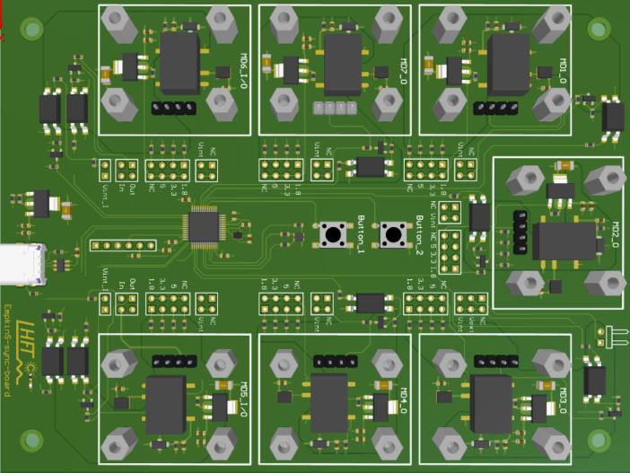

# EmpkinS Sync Board Hardware & Firmware

This Repository is part of the [EmpkinS Sync Board](https://github.com/empkins/empkins-sync-board) (ESB) project. The EmpkinS Sync Board can be used to **precisely synchronize different measurement modalities** on hardware level. 

The corresponding Firmware can be found here. It was developed for the microcontroller *STM32L151C8T6A*.
It generates different synchronization signals for 7 arbitrary outputs. In addition, it senses the occurrence of an external event through a change of the present level at the Input ports MD6, MD5,  or through its buttons. 

**PCB Overview** <br>


## Getting Started

### Hardware Requirements

First make sure to rebuild the [ESB Hardware](https://365.altium.com/files/B8C35FA4-1EF4-416A-BC0A-35B06F024184) correctly. This link provides the schematic, PCB, 3D view and BOM of the ESB hardware, which can be opened without installing Altium. 

### Flash EmpkinS Sync Board

To flash the firmware on the microcontroller you have to do the following steps.

1. Download the development environment [STM32CubeIDE](https://www.st.com/en/development-tools/stm32cubeide.html) version 1.12.0.

2. To install an editable version of the package from 
a local copy of the repository, run the following commands to clone the it: 

```bash
git clone https://github.com/empkins/empkins-sync-board-hardware.git

```
3. Connect a programming device, such as the [STM Nucleo-64](https://www.st.com/en/evaluation-tools/nucleo-f401re.html) development board, to the EmpkinS Sync Board as shown in the figure. Additionally the board must be supplied via the USB-C Port.


4. Run the Code in STMCubeIDE to complete the flashing process.

## Configure EmpkinS Sync Board for your Measurement Setup

The Sync Board is mounted to a PC via USB, which is also used for serial communication. To configure the behavior of the outputs as well as the measurement start and stop source, the corresponding [Graphical User Interface](TODO:add link) can be used. Alternatively, you can write your own scripts using an API for serial communication of your choice, e.g., [`pySerial`](https://pyserial.readthedocs.io/en/latest/) (requires basic programming skills). See [Command interface](#command-interface) for further details.

## Information for Developers

If you have basic programming knowledge, you can write your own scripts to communicate and configure the Sync Board. Have a look into the [Repository Structure](#repository-structure) if you want to adapt the firmware code or the command interface. 

### Install driver

A USB protocol is used as communication interface. You must ensure that you have an adequate driver installed that enables opening a port for serial communication.
* On Windows: [Virtual COM Port Driver](https://www.st.com/en/development-tools/stsw-stm32102.html)
* On MacOS: recognizes CDC(-ACM) devices like a virtual COM port without any extra driver.
* Alternatively, you can install [STM32CubeIDE](https://www.st.com/en/development-tools/stm32cubeide.html), which provides such drivers. 

### Command interface

If you are familiar with programming and/or don't want to use the provided [Graphical User Interface](https://github.com/empkins/empkins-sync-board-gui), you can develop your own configuration scripts using the commands from the following tables. 
Using python with `pySerial` interface, this could be as follows:
First, connect to the serial port. Depending on your OS, this might require admin rights.

```python
import serial
import sys


com_port = 'COM3' # insert the serial port name here
baudrate = 9600 # insert the baudrate of the serial port

# connect to sync board
try:
    ser = serial.Serial(com_port, baudrate, timeout=1)
except (OSError, serial.SerialException):
    print('connection failed')
    sys.exit()
ser.flush()
```

Afterward, you would need to set start and stop source. In this example, the measurement will be started without delay by pressing Button 1.
```python
import time

# command interface
hello = 'aa'

set_start_source_byte = '00'
set_stop_source_byte = '01'

button_1 = '01'
falling_edge = '02'

# set start source
start_delay_high = '00'
start_delay_low = '00'
ser.write(
    bytearray(
        [
            int(hello, 16),
            int(set_start_source_byte, 16),
            int(button_1, 16),
            int(start_delay_high, 16),
            int(start_delay_low, 16),
            int(falling_edge, 16),
        ]
    )
)
time.sleep(0.1)

# set stop source
stop_delay_high = '00'
stop_delay_low = '00'
ser.write(
    bytearray(
        [
            int(hello, 16),
            int(set_stop_source_byte, 16),
            int(button_1, 16),
            int(stop_delay_high, 16),
            int(stop_delay_low, 16),
            int(falling_edge, 16),
        ]
    )
)
time.sleep(0.1)
```

Then, you need to activate and configure the outputs to which measurement devices will be mounted. In this example, these are MD1 and MD2, who will both emit a rising clock signal with a frequency of 100 Hz for synchronization.
```python
# command interface
hello = 'aa'

set_output_byte = '03'

clock_rising = '03'

md_1 = '00'
md_2 = '01'

is_active = '01'
no_stop_trigger = '00'

# set outputs
output_delay_high = "00"
output_delay_low = "00"
degree = "00"
pulse_len_high = 0
pulse_len_low = 0
freq_high = 0
freq_low = 100

# md1 output
ser.write(
    bytearray(
        [
            int(hello, 16),
            int(set_output_byte, 16),
            int(md_1, 16),
            int(is_active, 16),
            int(output_delay_high, 16),
            int(output_delay_low, 16),
            int(clock_rising, 16),
            pulse_len_high,
            pulse_len_low,
            freq_high,
            freq_low,
            int(no_stop_trigger, 16),
            int(degree, 16),
        ]
    )
)
time.sleep(0.1)

# md2 output
ser.write(
    bytearray(
        [
            int(hello, 16),
            int(set_output_byte, 16),
            int(md_1, 16),
            int(is_active, 16),
            int(output_delay_high, 16),
            int(output_delay_low, 16),
            int(clock_rising, 16),
            pulse_len_high,
            pulse_len_low,
            freq_high,
            freq_low,
            int(no_stop_trigger, 16),
            int(degree, 16),
        ]
    )
)
time.sleep(0.1)
```
To read messages from the Sync Board, a listener can be setup as follows:

```python
# read board messages
try:
    while True:
        time.sleep(1)
        y = ser.read(size=1)
        print(y)
except KeyboardInterrupt:
    ser.close()
    print("serial port closed")
```

#### SyncBoard &rarr; Controllig PC
|0. Byte|1. Byte|2. Byte|3. Byte|4. Byte|5. Byte|6. Byte|7.Byte|8.Byte|9.Byte|10. Byte|11. Byte|12.Byte
|:----|:----|:----|:----|:----|:----|:----|:----|:----|:----|:----|:----|:----|
|0xaa:Hello|0x00: SetStartSource|  0x00: USB <br> 0x01:Button1 <br> 0x02:Button2 <br> 0x04: MD5 <br> 0x05: MD6|delay[HighByte]|delay[LowByte]|0x02:FallingEdge <br> 0x03:RisingEdge <br>  0x04: AnyEdge| | | | | |
|0xaa:Hello|0x01: SetStopSource|0x00: USB <br> 0x01:Button1 <br> 0x02:Button2 <br> 0x04: MD5 <br> 0x05: MD6|delay[HighByte]|delay[LowByte]| 0x02:FallingEdge <br> 0x03:RisingEdge <br> 0x04: AnyEdge| | | | | 
|0xaa:Hello|0x02: SetEvent|0x01:Button1 <br> 0x02:Button2 <br> 0x04: MD5 <br> 0x05: MD6|0x00: not active <br> 0x01: active|0x02:FallingEdge <br> 0x03:RisingEdge <br> 0x04: AnyEdge| | | | | | |
|0xaa:Hello|0x03: SetOutput|0x00: MD1 <br> 0x01: MD2 <br> 0x02: MD3 <br> 0x03: MD4 <br> 0x04: MD5 <br> 0x05: MD6 <br> 0x06: MD7 |0x00: not active <vr> 0x01: active|delay[HighByte]|delay[LowByte]|0x00:FallingTrigger <br> 0x01:RisingTrigger <br> 0x02: FallingEdge <br> 0x03: RisingEdge <br> 0x05:FallingClock <br> 0x06: RisingClock <br> 0x07:M-Sequence|pulseLength[HighByte]|pulseLength[LowByte]|freq[HighByte]|freq[LowByte]|0x00:noStopTrigger <br> 0x01: stopTrigger|M-Sequence degree|
|0xaa:Hello|0x05:startMeasurment| | | | | | | | | |
|0xaa:Hello|0x06:stopMeasurment| | | | | | | | | |
|0xaa:Hello|0x0a: resetErrorState | | | | | | | | | |
|0xaa:Hello|0xFF: WhoAmI| | | | | | | | | |


#### Controlling PC &rarr; SyncBoard
|0. Byte|1. Byte|2. Byte|
|:----|:----|:----|
|0xaa: Hello|0x00: Error| 0x02: SourceNotUsed <br> 0x03: NoSuchStopSource <br> 0x04: NoSuchStartSource <br> 0x05: InvalidDataReceived <br> 0x06: NoSuchClockSource <br> 0x07: NoSuchMessage <br> 0x08: NoSuchDevice <br> 0x09: NoSuchInput <br> 0x10: AllocationFailed|
|0xaa: Hello|0x01: Event|0x01: Button1 <br> 0x02: Button2 <br> 0x04: MD5 <br> 0x05: MD6|
|0xaa: Hello|0x02: Run|0xbb: MeasurementRun <br> 0xcc: MeasurementStop| 
|0xaa: Hello|0xaa: HelloResponse|| 

## Repository structure

The repository is structured as follows:

```bash
├── empkins-sync-board-hardware/  
    └── firmware                                    # firmware code for ESB
        ├── .settings                               
        └── Core/                                   # user files         
            ├── inc/                                # Header files    
            ├── src/                                # Source files  
            │   ├── gpio.c                          # I/O initialization
            │   ├── main.c                          # default initialization of peripherals and user code
            │   ├── m-sequence.c                    # generates M-sequence
            │   ├── stm32l1xx_hal_msp.c             # initialization of service peripherals cooperating with others
            │   ├── stm32l1xx_it.c                  # contains interrupt handlers
            │   ├── syscalls.c                      # STM32CubeIDE Minimal System calls file
            │   ├── sysmem.c                        # STM32CubeIDE System Memory calls file
            │   ├── system_stm32l1xx.c              # Common Microcontroller Software Interface Standard (CMSIS)
            │   └── tim.c                           # configuration of the TIM instanced
            └── Startup                             
        ├── Drivers                                 # CMSIS and stm32l1 HAL driver
        ├── Middlewares                             # STM32_USB_Device_Library
        └── USB_DEVICES                             
            ├── App/                                
            │    ├── usb_device.c                   # implements the USB Device
            │    ├── usbd_cdc_if.c                  # Usb device for Virtual Com Port
            │    └── usbd_desc.c                    # implements the USB device descriptors
            └── Target                              # brief explanation, automatically generated
        └── Debug                                   # debugging files, automatically generated
```
Have a look into `empkins-sync-board-hardware/firmware/Core/src/main.c` if you want to make modifications to the connections or the command interface.


